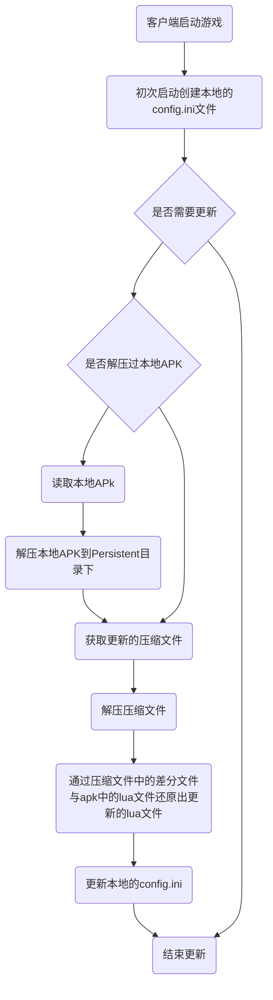

**更新流程：**

1、打出基础的apk包。

2、更改StreamingAssets下的Lua文件(Resources下的文件在Unity打包的过程中会压缩、加密，因此解压apk时不能将他释放出来，而StreamingAssets下的文件则正常释放到apk中。)

3、打出新的apk包。

4、通过Unity菜单栏的 Zip/UnZip解压出两个Apk包（这一步需要做两次，而且需要自己修改代码中的apk路径 默认路径： D:/Apk）

5、通过菜单栏中的Diff/Build Diff File差分出解压后的两个Apk包之间的差异包（默认路径是 D:/Apk/Diff）

6、通过菜单栏中的Zip/Build Zip压缩差异包，同时生成版本文件。（默认路径是 D:/Apk/Diff）

7、将第6步生成的压缩文件和版本文件放到服务器中。

8、启动游戏完成更新

**注意事项：**

1、生成差异包的过程中，解压Apk、差分apk的lua文件、压缩差分文件的路径需要自己设置、未完成完全的自动打差异包功能。（菜单栏的代码在Assets/Editor下）

2、由于服务器地址是本机地址，因此更换网络环境后需要自行更改。

3、多版本更新不稳定。

**未完成的功能：**

1、客户端的版本文件和服务端版本文件的比较

2、多版本更新的流程处理、及多版本的Loader编写

3、CRC码的校验。

4、代码耦合度高，后续应该尽可能降低耦合度。

5、热更新流程为C#编写，需要移植到Lua中。

6、客户端本地还原后删除差分文件

7、断点续传的功能（代码已经写好，还未应用）